# KRT Drivers Point System (DPS IOS)

# KRTドライバーズポイントシステム (DPS IOS)

© L3 Solution Co., Ltd. 2026

---

## Description / 説明

DPS (Drivers Point System) is an IOS application that allows drivers to request point withdrawals. The app provides various features to enhance the user experience and streamline the point management process.

DPS (Drivers Point System) は、ドライバーがポイントの引き出しをリクエストできるようにする IOS アプリケーションです。このアプリは、ユーザーエクスペリエンスを向上させ、ポイント管理プロセスを合理化するためのさまざまな機能を提供します。

---

## Version History / バージョン履歴

- `1.1.0` (current stable version / 現在の安定バージョン)

---

## Installation / インストール

**Link to install the app / アプリをインストールするためのリンク:**
[https://testflight.apple.com/join/ukcieTGp](https://testflight.apple.com/join/ukcieTGp)

---

## Notes / ノート

- For the first time, there will be no driver. So the admin or the branch manager should create a driver by using the web portal ([http://153.122.194.56/](http://153.122.194.56/)).
- 初回はドライバーが不在となります。したがって、管理者または支店長は Web ポータル ([http://153.122.194.56/](http://153.122.194.56/)) を使用してドライバーを作成する必要があります。

- Or use a Test User / またはテストユーザーを使用します:
  - **Username / ユーザー名:** huidromddev@gmail.com
  - **Password / パスワード:** Darshan1#

---

## Major Screens / 主な画面

### 1. Login Screen / ログイン画面

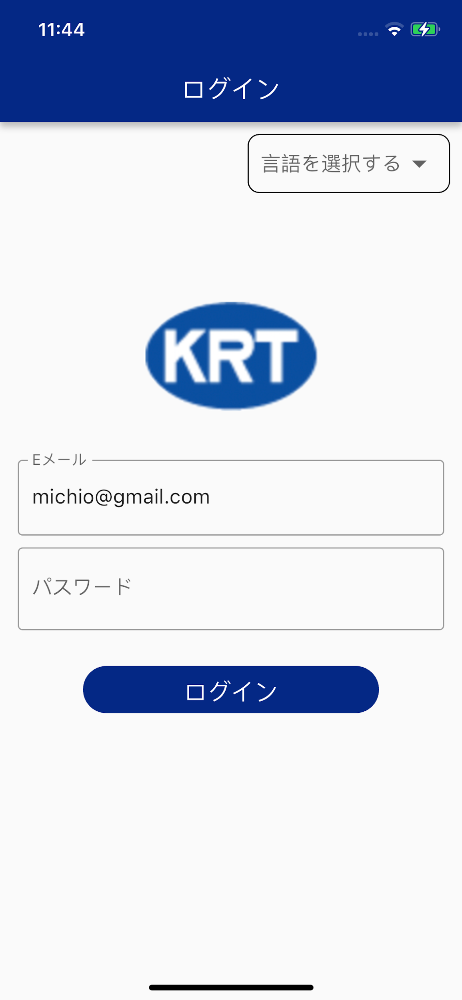

- Enter the correct username (registered email ID) and password (e.g., Username: `huidromddev@gmail.com`, Password: `Darshan1#`) to log in to the app. When login is successful, it will land on the Dashboard page.
- 登録したメールIDとパスワードを正しいユーザー名（例：ユーザー名: `huidromddev@gmail.com`、パスワード: `Darshan1#`）を入力してアプリにログインしてください。成功すると、ダッシュボード ページが表示されます。

- The language of the app can be changed from the topmost right globe icon.
- アプリの言語は右上の地球儀アイコンから変更できます。

- The app can log in with Face Unlock if it is enabled from the app settings.
- アプリの設定で顔認証を有効にしている場合、アプリは顔認証でログインできます。

- Face Unlock will not be visible for the app installing for the first time. It should be enabled from the app settings once the app is logged in.
- 初めてインストールするアプリでは顔認証は表示されません。アプリにログイン後、アプリの設定から有効にする必要があります。

#### a) Language Change Dropdown / 言語変更ドロップダウン

- Press the language button in the top right corner of the Login screen to display the language dialog.
- ログイン画面右上の言語ボタンを押すと言語ダイアログが表示されます。

- The language can be changed to either English or Japanese.
- 言語は英語または日本語に変更可能です。

#### b) Face ID / 顔認証

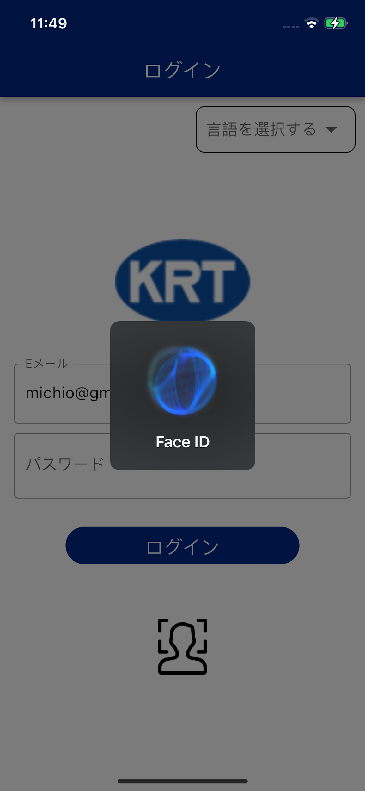

- The app can log in with Face ID on supported devices.
- アプリは、サポートされているデバイスで Face ID を使用してログインできます。

- Press the Face icon on the Login page to display the Face Unlock page.
- ログインページにある顔アイコンを押すと、顔認証解除ページが表示されます。

- The app will log in whenever the registered face is detected.
- アプリは登録した顔を検出するたびにログインします。

---

### 2. Dashboard Screen / ダッシュボード画面

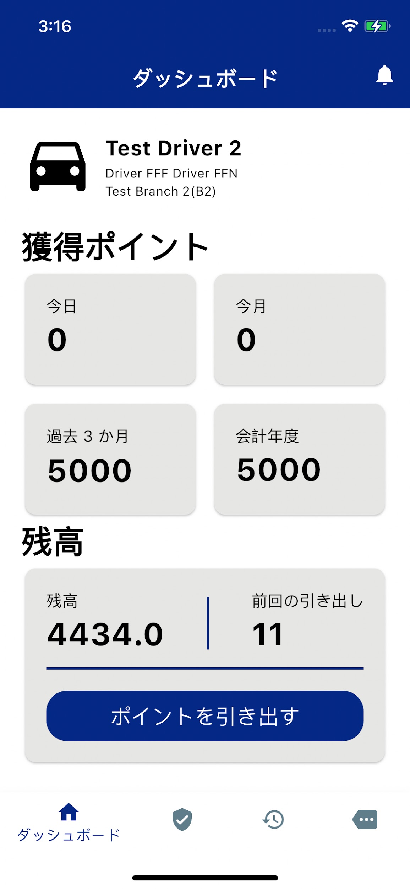

- Shows earning/reward points, balance, and recent withdrawals.
- 獲得/特典ポイント、残高、最近の出金を表示します。

#### Point Withdraw Dialog / ポイント引き出しダイアログ

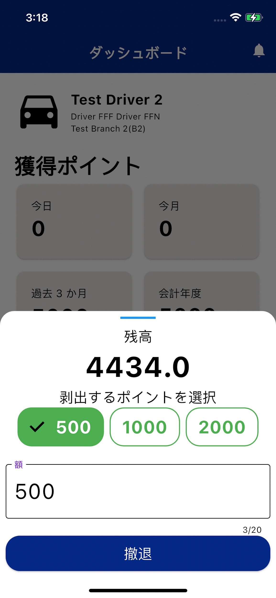

- Press the **Withdraw Point** button on the Dashboard page.
- ダッシュボードページにある「ポイントを引き出す」ボタンを押します。

- The Point Withdraw dialog allows selecting a preset point amount or entering a custom amount.
- ポイント引き出しダイアログでは、指定されたダイアログからポイントを選択または入力することができます。

---

### 3. Notification Screen / 通知画面

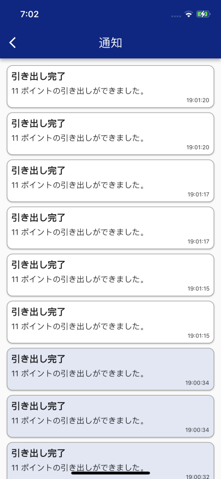

- Shows notifications like general notifications, reward credit messages, etc.
- 一般通知、特典クレジットメッセージなどの通知を表示します。

- The **white background** notification indicates a user-specific notification.
- 背景が白の通知は、ユーザー固有の通知を示します。

- The **very light blue background** notification indicates a general notification.
- 非常に薄い青色の背景の通知は、一般的な通知を示します。

---

### 4. Profile Screen / プロフィール画面

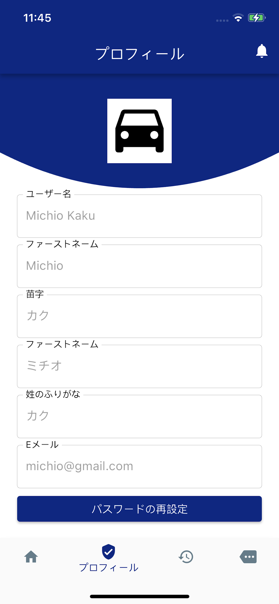

- Shows details of the driver profile such as name, email, furigana, family name, and first name.
- 名前、電子メール、フリガナ、姓などのドライバーのプロフィールの詳細を表示します。

- Has a button to reset the password.
- パスワードをリセットするボタンが付いています。

---

### 5. History / Transaction Screen / 履歴・取引画面

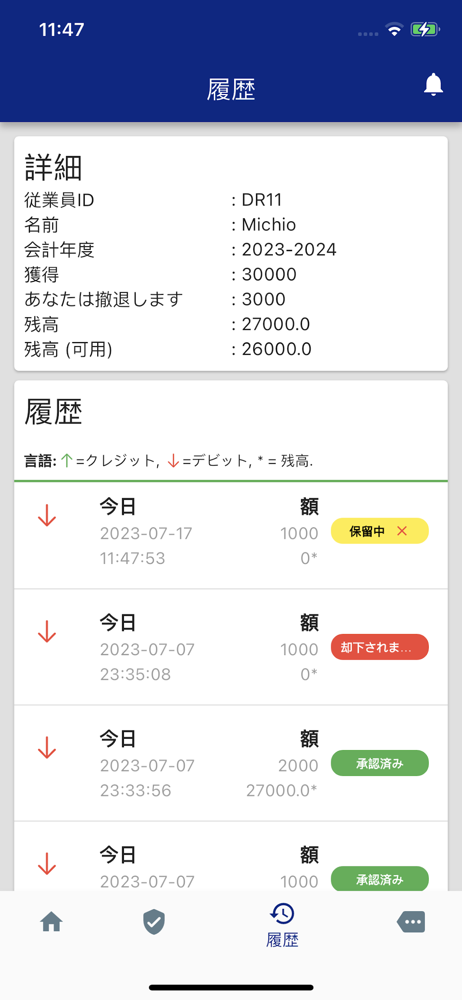

- Shows details such as earnings, withdrawals, financial year, balances, etc.
- 収入、出金、会計年度、残高などの詳細を表示します。

- Shows transaction details. Transactions can be reward/withdraw type.
- 取引内容を表示します。取引は報酬/出金が可能です。

- 🟢 **Green up arrow** indicates a reward/credit point transaction.
- 緑色の上矢印は特典/クレジットポイント取引を示します。

- 🔴 **Red down arrow** indicates a withdraw/debit point transaction.
- 赤い下矢印は出金・引き落としポイント取引を示します。

**Transaction Status / トランザクションのステータス:**

| Status | Color | ステータス | 色 |
|--------|-------|-----------|-----|
| Pending | 🟡 Yellow | 保留中 | 黄色 |
| Accepted | 🟢 Green | 受け入れ済み | 緑色 |
| Rejected | 🔴 Red | 拒否されました | 赤色 |
| Modified | 🔵 Blue | 変更 | 青色 |
| Updated | 🟢 Green | 更新 | 緑色 |

#### Delete Pending Withdrawal / 保留中の出金を削除

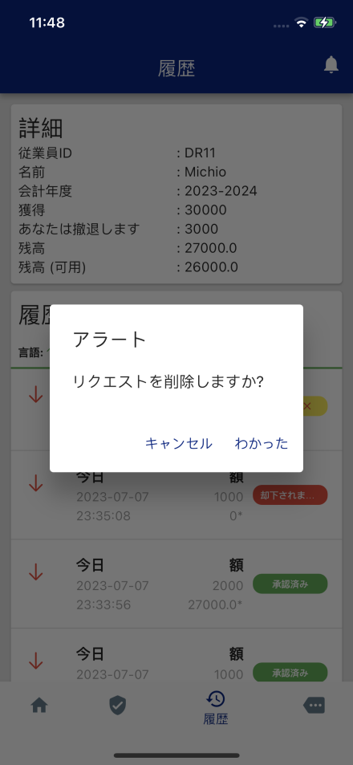

- A pending withdrawal transaction can be deleted from the app by clicking the delete button as shown in the figure.
- 出金トランザクションの保留ステータスは、図に示すように削除ボタンをクリックしてアプリから削除できます。

---

### 6. Settings / 設定

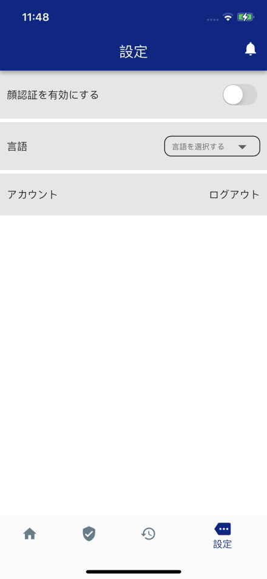

- Enable/disable Face Unlock by pressing **"Enable Face unlock"**.
- 「顔認証を有効にする」を押すと、顔認証を有効/無効にできます。

- Change language by pressing **"Select Language"**.
- 「言語の選択」を押すと言語を変更できます。

- Log out of the app by pressing **"Logout"**. Once logged out, the app will clear login credential data.
- 「ログアウト」を押すとアプリからログアウトできます。ログアウトすると、アプリはログイン資格情報データを消去します。

- Check version and version history by pressing **"App Version 1.1.0"**.
- 「アプリバージョン 1.1.0」を押すとバージョンとバージョン履歴が確認できます。

#### Version History Dialog / バージョン履歴ダイアログ

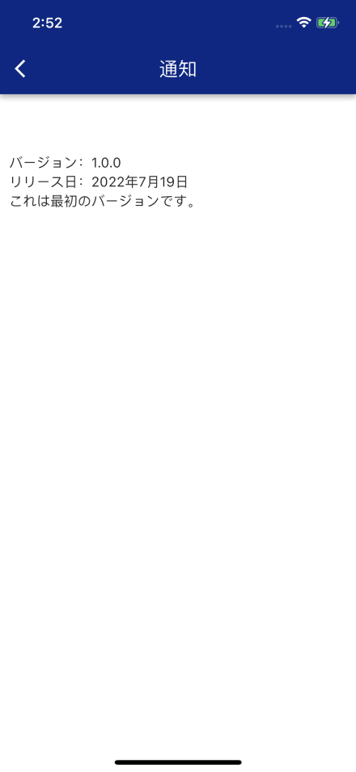

---

### 7. Reset Password Screen / パスワードのリセット画面

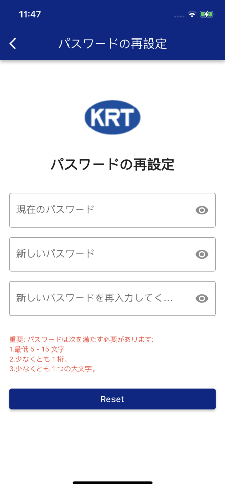

- Click the **Reset Password** button from the Profile page to open the reset password screen.
- プロフィールページから「パスワードをリセット」ボタンをクリックすると、パスワードのリセット画面が開きます。

- Enter the current password, followed by the new password, and re-enter the new password in the respective input fields.
- 現在のパスワードを入力してから新しいパスワードを入力し、それぞれの入力フィールドに新しいパスワードを再入力します。

- The new password must have **at least 4 characters** and must include **at least 1 digit** and **1 uppercase letter**. E.g., `Driver#1` satisfies all conditions.
- 新しいパスワードが 4 文字以上であることを確認し、少なくとも 1 つの数字と 1 つの大文字を含める必要があります。たとえば、`Driver#1` はすべての条件を満たします。

- Press the **Reset** button.
- リセットボタンを押します。

---

## Contact / 接触

If you have any questions or inquiries regarding DPS, please contact our support team at:
**[l3solutionjapan@gmail.com](mailto:l3solutionjapan@gmail.com)**

DPS に関するご質問やお問い合わせは、サポートチーム ([l3solutionjapan@gmail.com](mailto:l3solutionjapan@gmail.com)) までお問い合わせください。

---

© L3 Solution Co., Ltd. 2026